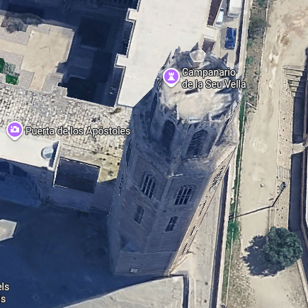
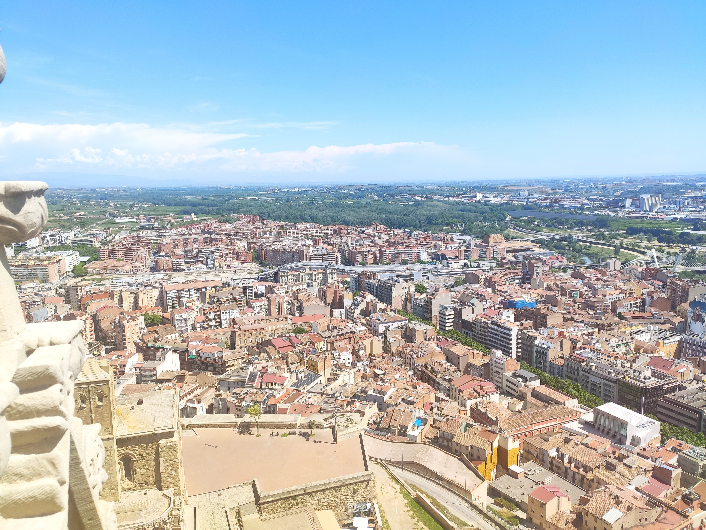
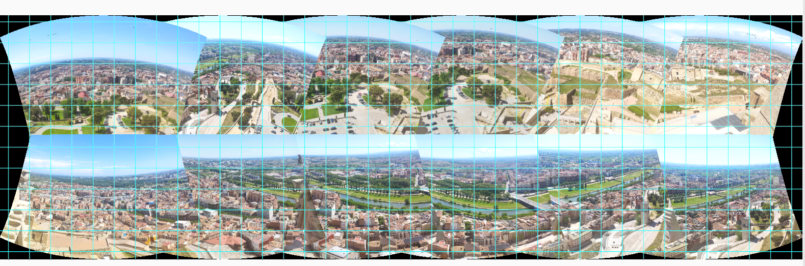
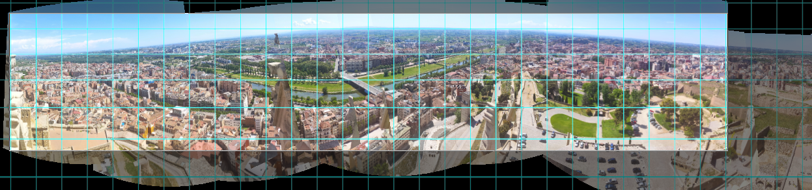
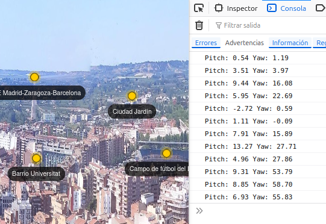

# CREACIÓN Y PUBLICACIÓN DE PANORAMAS

Metodología para crear y publicar un panorama a partir de varias fotografías

Para los indecisos aquí tenéis el enlace al panorama viewer
[)]([https://example.com/...](https://josemamira.github.io/pano/index.html))

**Crear un panorama utilizando varias fotografía con solape con Hugin y visualizándolo en una página web con Pannellum**

## CONTEXTO

En el viaje de Geografía a Jaca pudimos visitar al regreso la ciudad de Lleida. Algunos, entre los que me encuentro pudimos subir a la torre campanario de base octogonal con sus 200 escalones. Desde arriba fui haciendo fotografías por cada uno de sus 8 caras. En principio no tenía ninguna intención de crear ningún panorama. Sólo quería tener una fotografía de cada parte de la ciudad.

 

Más tarde me planteé crear un panorama con las fotografías. Ya se que muchas cámaras de los móviles permiten hacerlo, pero el resultado no es tan satisfactorio.

Si hubiese tenido claro desde el principio que es lo que quería me hubiese planteado una metodología más apropiada con:

  

- fotografía realizada a la misma distancia focal (sin hacer diferente zoom a cada foto)
- evitar que aparezcan por los laterales de la fotografía partes de la propia torre

- mantener la misma horizontal en todas la fotos (se necesita trípode)
- seguir una secuencia ordenada de fotografías. Es recomendable realizar la primera foto al sur para que el norte en el panorama quede en el centro de la imagen. Esto ayuda mucho a interpretar las orientaciones en la imagen, además de que en la página web se puede utilizar la utilidad para ver la orientación
 

  >                          S → W → N → E → S

Para facilitar la realización de fotografías se suele poner en el trípode una pequeña planilla con las orientaciones.

  

Algo parecido es lo que hacen los panoramas que se usan en Google Street View, que no es más que un trípode con 8 cámaras que se disparan al unísono, y que cada foto comparte parte de sus laterales con sus contiguas (solapamiento). Luego un software procesa los puntos comunes y compone el panorama

# METODOLOGÍA:

  

## Parte 1: Creación del panorama
  

Más tarde me propuese crear un panorama con cada una de las fotografía realizadas. Para ello me instalé el veterano programa **Hugin**, que tiene una utilidad llamada **“Panorama creator”**.

Hugin utiliza las mismas técnicas que se aplica para la generación de ortofotos, salvo que no produce una imagen georreferenciada, ni tampoco está apoyada en un MDE que cuadre las distorsiones de las pendientes. Pero tiene búsqueda y alineación de puntos homónimos en fotos y proyecciones cartográficas, pero aplicadas a fotos.

Esta utilidad consta de 3 pasos:


1. Carga de las fotografías: no tiene ningún secreto. Una vez cargadas intenta hacer una panorama rápido

  
  
2. Alienado: Alinea todas las imágenes, crea puntos de control y optimiza las posiciones de las imágenes. Se trata de un proceso automático y muy eficiente

  
  
Opcionalmente se pueden realizar operaciones como:

- extensión y encuadre del panorama
- selección de la proyección

  

3. Generación del panorama en un ficheros. La salida será un fichero en formato TIFF. Este es el resultado

  

Obviamente la salida tiene errores de bulto como parte del torreón en los laterales y en parte de la ciudad. No obstante, y para las pocas precauciones que tomé me parece más que satisfactorio.

  

## Parte 2: Publicación

  

No tiene mucho sentido crear un panorama sino tienes una interfaz de usuario para sacarle punta a las peculiaridades de un archivo como este. Entre las opciones existentes opté por publicar el panorama en una página web que utiliza una utilidad en lenguaje Javascript denominada “Pannellum”, y tal como dice su portal web se trata de un visor para la web de código abirerto, libre y ligero. Utiliza HTML5, CSS3, JavaScript, y WebG.

Pannellum nos permite navegar por el panorama como su estuviesemos en directo en pleno torreón. Podemos hacer zoom, pan al igual que cualquier mapa.

Uno de los aspectos que más me llama la atención es la posibilidad de añadir “hot spot” a la imagen. Estos elementos son iconos subrepuestos a la imagen que al hacer clic se lanza un evento, que puede ser lo que quieras. En mi caso he añadido un pequeño bocadillo (popup) con una breve descripción.

Cada hot spot precisa de 2 elementos claves, como es su “Pitch” y “Yaw”. Para entendernos son las coordenadas de la imagen teniendo en cuenta existe un eje de coordenadas cuyo origen es el centro del fotograma, de forma que el pitch sería el equivalente a la longitud, siendo positiva en la mitad superior y negativa en la inferior. Por otra parte el yaw es el equivalente a la latitud, siendo positiva al este y negativa al oeste.

He optado por crearlos a mano añadiendo una pequeña utilidad en el código (con javascript) que al hacer clic en la imagen me permite obtener el valor de pitch y yaw en la consola del navegador (se activa con F12 en el caso del navegador Firefox.

  

Estos valores los utilizo para crear hot spot en el código fuente. Cada uno de ellos tiene este contenido en una estructura en formato JSON (a algunos me imagino que les recordará a nuestro GeoJSON)

Ejemplo con 2 hot spot:

  

  
```json
{
  pitch: -27.8,
  yaw: : -30,
  cssClass: 'empty',
  createTooltipFunc: hotspot,
  createTooltipArgs: {
    title: 'Plaça de Sant Joan',
    text: 'La plaça de Sant Joan ha sido, desde hace siglos, un lugar ....'
  }
},
{
  pitch: -8.47,
  yaw: -5.44,
  cssClass: 'empty',
  createTooltipFunc: hotspot,
  createTooltipArgs: {
    title: 'Torre ascensor',
    text: 'Torre de base triangular que incluye un ascensor que ...'
 }
}
```

Y el resultado lo podéis ver en el siguiente enlace:

  

Saludos
